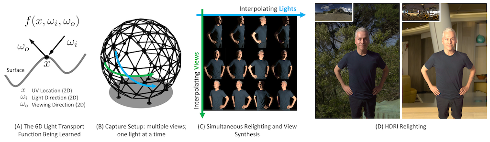

# Neural Light Transport (NLT)

ACM Transactions on Graphics 2021

[[arXiv]](https://arxiv.org/pdf/2008.03806.pdf)
[[Video]](https://www.youtube.com/watch?v=gWdKjxCmYMI)
[[Project]](http://nlt.csail.mit.edu/)

This is the authors' code release for:
> **Neural Light Transport for Relighting and View Synthesis**  
> Xiuming Zhang, Sean Fanello, Yun-Ta Tsai, Tiancheng Sun, Tianfan Xue,
> Rohit Pandey, Sergio Orts-Escolano, Philip Davidson, Christoph Rhemann,
> Paul Debevec, Jonathan T. Barron, Ravi Ramamoorthi, William T. Freeman  
> **TOG 2021**

in which we show how to train neural networks to perform simultaneous relighting
and view sythesis, exhibiting complex light transport effects (such as
specularity, subsurface scattering, global illumination, and etc.):

Dragon (specular) | Dragon (subsurface scattering)
------------ | -------------
 | 

This repository contains our rendered data, the code that rendered those data,
and TensorFlow 2 (eager) code for training and testing NLT models.

If you use this repository or find it useful, please cite the paper
([BibTeX](http://people.csail.mit.edu/xiuming/docs/bib/nlt.bib)).

This is not an officially supported Google product.

## Before You Start...

### Relighting Only?

The UV texture space formulation is most useful when views vary.
If you are doing relighting from a fixed viewpoint, you can simply
skip mapping between the camera and UV spaces. That is, you can
just treat the camera-space ("normal-looking") images as UV-unwrapped ones.
Intuitively, this is equivalent to using an identity mapping as UV (un)wrapping.

### Relighting *or* View Synthesis (Not Simultaneously)?

If you do not care about simultaneous relighting and view synthesis, you can
simply use a "slice" of the released data. For instance, if you are doing just
view synthesis, then you can fix lighting by training on just the multi-view
data under that lighting condition.

If you are rendering your own scene (see
[the data generation folder](data_gen/)), use a single JSON path with
no wildcard to fix the view or light.

## Data

We provide both our rendered data and the scripts, so that you can either
just use our data or render your own Blender scenes.

### Download Metadata

See "Downloads -> Metadata" of [the project page](http://nlt.csail.mit.edu).

### Download Our Rendered Data

See "Downloads -> Rendered Data" of [the project page](http://nlt.csail.mit.edu).

### (Optional) Render Your Own Data

Blender 2.78c is used for scene modeling and rendering. The code was tested
on Ubuntu 16.04.6 and 18.04.3 LTS, but should work with other reasonable OS
versions.

See [the data generation folder](data_gen/) and its own README.

## Model Training and Testing

We use TensorFlow 2 (eager execution) for neural network training and testing.
The code was tested on Ubuntu 16.04.6 LTS, but should work with other
reasonable TensorFlow or OS versions.

See [the training and testing folder](nlt/) and its own README.

### Pre-Trained Models

See "Downloads -> Pre-Trained Models" of [the project page](http://nlt.csail.mit.edu).

## Issues or Questions?

If the issue is code-related, please open an issue here.

For questions, please also consider opening an issue as it may benefit future
reader. Otherwise, email [Xiuming Zhang](http://people.csail.mit.edu/xiuming).

## Changelog

* 01/05/2021: See the 01/07/2021 commits; v3 paper and video (TOG camera-ready ver.).
* 08/20/2020: Updated the paper and the video.
* 08/07/2020: Initial release.
